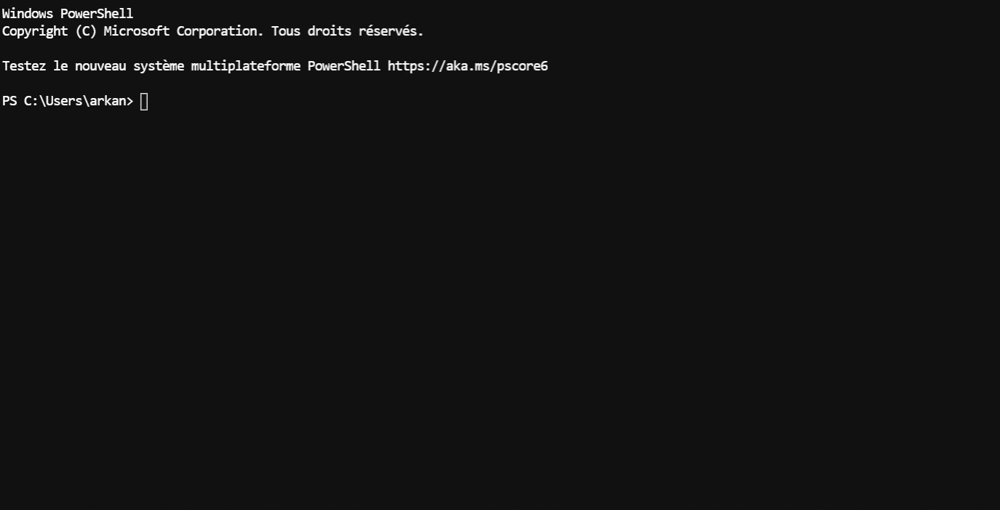

# Présentation :

# Notice utilisateur :

## Application `app_basique.py`

On pourra faire `python -m prog_dual` pour un exemple avec des lots non fractionnables.

### Exemple avec le paramètre `fch` :

### Exemple avec le paramètre `std` :

## Application `app_gui.py`

