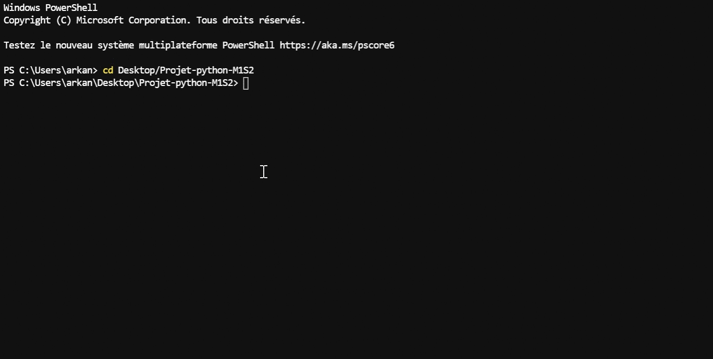

# Présentation :

On trouvera dans ce dépot : 

- un dossier prog_dual contenant les modules `affichage.py`, `probleme.py` et `resolution.py` 
- un dossier tests contenant les tests vérifiant les fonctions.
- les applications en `.py` pour lancer notre programme :
    - Une application avec interface utilisateur (app_gui),
    - une application basique avec sortie en consoles
- un fichier data.txt nécessaire à l'utilisation de l'app_basique.py (données du problème)
- un fichier README.txt comprenant la notice utilisateur
- un fichier SUJET.txt comprenant le sujet du projet. 
- un fichier rapport.html comprenant un rapport plus détaillé concernant ce projet. Une version ipynb de ce rapport est également présente.  

# Notice utilisateur :

## Application `app_gui.py`

Le Gif ci-dessous montre l'utilisation de l'application GUI.
On voit comment l'utiliser et on peut observer la gestion des erreurs. On distingue:
- Un lot non valide,
- un problème non valide,
- une erreur de syntaxe dans l'entrée des données.

On pourra se référer au document `rapport.html` pour plus de détail sur ce qu'est un lot valide et un problème valide.

## Application `app_basique.py`

Les Gif ci-dessous montrent l'utilisation de l'application basique depuis un terminal. 

Précisions sur les arguments : 

- On précisera **"fch"** pour une résolution à partir d'un fichier texte se trouvant dans le même dossier que l'application. On indiquera alors en dernier argument le nom du fichier (**"nom_fichier.txt"**).
- On précisera **"std"** pour une résolution à partir des données rentrées directement dans le terminal.
- On précisera en deuxième argument si l'on souhaite le cas où les sont fractionnables (**"True"**) ou non (**"False"**). 

On pourra faire `python -m prog_dual` pour un exemple avec des lots non fractionnables.

### Exemple avec le paramètre `fch` :

### Exemple avec le paramètre `std` :

