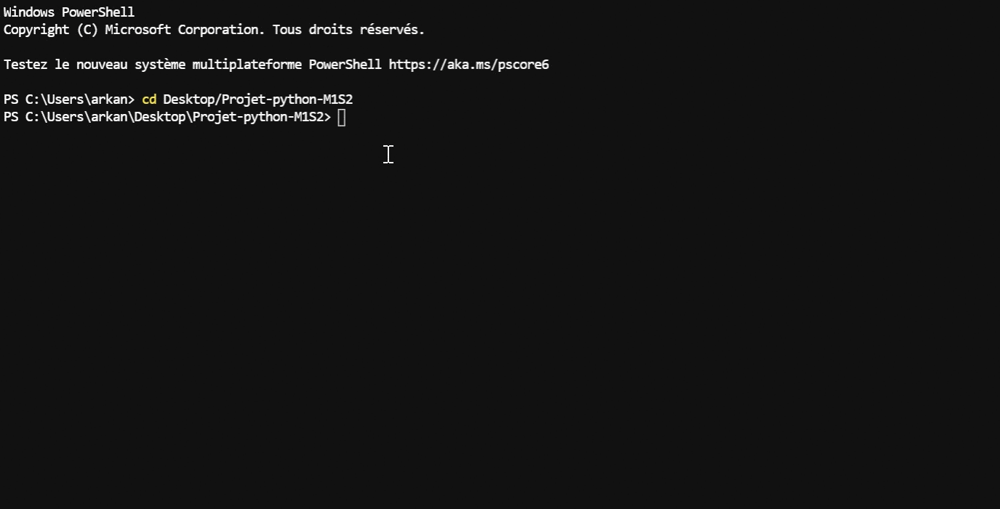

# Présentation :

On trouvera dans ce dépot : 

- un dossier prog_dual contenant les modules `affichage.py`, `probleme.py` et `resolution.py` 
- un dossier tests contenant les tests vérifiant les fonctions. 
- les applications en `.py` pour lancer notre programme. 
- un fichier data.txt nécessaire à l'utilisation de l'app_basique.py (données du problème)
- un fichier README.txt comprenant la notice utilisateur
- un fichier SUJET.txt comprenant le sujet du projet. 
- un fichier rapport.html comprenant un rapport plus détaillé concernant ce projet. 

# Notice utilisateur :

## Application `app_gui.py`

## Application `app_basique.py`

On pourra faire `python -m prog_dual` pour un exemple avec des lots non fractionnables.

### Exemple avec le paramètre `fch` :

### Exemple avec le paramètre `std` :

